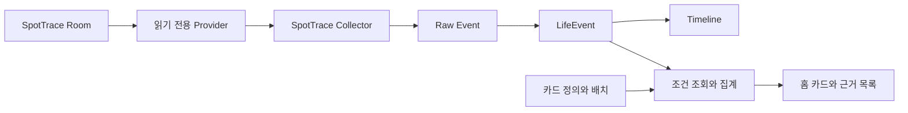

# SpotTrace 연동과 커스텀 대시보드 설계 검토

작성: 2026-10-08 (Asia/Seoul). 최초 검토 후 사용자 구현 승인. 현재 구현 결과는 9절을 따른다.

최초 요청은 기능 검토였으며, 기본 카드 추가·삭제·순서 변경과 조건 기반 사용자 집계 카드 모두 포함한다. 필요하면 SpotTrace 기능도 수정·확장할 수 있다고 확인했고 이후 “수정진행해”로 구현을 승인했다. 1~8절은 최초 검토 기록이며 아래 구현 결과에서 확정/변경 사항을 구분한다.

## 1. 현재 소스에서 확인한 사실

- Life Dashboard의 DashboardContent는 일정·수면·걸음·운동, 일정 목록, 결제·배송·예약을 고정 순서로 렌더링한다. 사용자 카드 정의/배치 저장 기능은 없다.
- HomeAppLinks는 네 지표의 실행 앱 패키지명만 저장한다. 앱 실행 연결은 외부 앱 데이터 연동과 별개다.
- Store.kt는 5개 Room 테이블/schema v1을 사용한다. type/sourceType은 문자열이고 dataJson이 있어 방문 기록 수용에 반드시 새 이벤트 테이블이 필요한 것은 아니다.
- LifeRepository.ingest는 sourceType+sourceKey로 Raw revision과 동일 LifeEvent를 갱신한다. 재설치/DB 초기화 뒤 재사용되는 외부 숫자 ID는 별도 데이터셋 식별자가 필요하다.
- 현재 TimelineQuery는 하루/타입 필터다. 기간·장소·가맹점 조건으로 카드의 근거 기록을 보는 조회 기능은 추가해야 한다.
- changesSummary는 기존 일간 집계용 필드만 비교한다. 가맹점/태그 등 커스텀 필터 필드 변경을 이 함수만으로 감지할 수 없다.
- SpotTrace 검토 경로: C:/Users/cafea/AndroidStudioProjects/SpotTrace. 다수의 기존 미커밋 변경이 있으며 현재 작업 파일을 읽었다. 설치 APK나 원격 배포본과 일치한다고 검증하지 않았다.
- TraceEntity(attendance_records)는 id, locationName, timestamp, dateString, type(ENTER/EXIT)을 저장한다. 고정 장소 ID, 수정 시각, 삭제 이력은 없다.
- GeofenceConfigEntity에는 requestId와 좌표/반경이 있지만 기록 생성 시 requestId는 TraceEntity에 저장되지 않는다. 과거 기록에 좌표/장소 ID가 있었다고 간주할 수 없다.
- TraceDao는 삽입과 물리 삭제를 지원한다. 숫자 ID 이후만 읽는 방식으로는 과거 기록 삭제를 발견하지 못한다.
- HistorySummary.visitSummaries의 days는 같은 장소명/날짜에 ENTER와 EXIT가 모두 있는 날짜 수다. ENTER 횟수나 ENTER가 있는 날짜 수와 다르다.
- Manifest에 기록 조회 Provider가 없다. 확인한 Firebase 조회 경로는 APK 업데이트 메타데이터이며 방문 이력 동기화 경로는 확인되지 않았다.

## 2. 추천 구성과 범위

같은 Android 사용자 프로필/휴대폰에 두 앱이 설치된 구성을 전제로 한다. 다른 기기의 SpotTrace를 읽는 동기화는 별도 설계다.

- 위치 감지/장소 관리는 SpotTrace가 담당한다. Life Dashboard는 저장된 방문 기록을 가져온다.
- 기존 로컬 저장 구조를 유지한다. 새 클라우드/계정/위치 자동화 엔진은 추가하지 않는다.
- SpotTrace의 Provider, Life Dashboard의 Collector를 각각 추가하므로 두 앱의 업데이트가 필요하다.
- 앱 미설치/구버전/연동 꺼짐/조회 실패/최근 동기화 성공을 구분한다. 마지막 ENTER를 현재 실제 위치라고 단정하지 않는다.

## 3. SpotTrace 변경 제안

### 데이터 제공과 접근

- 버전이 있는 읽기 전용 계약으로 데이터셋 ID, 기록 ID, 장소 이름, 기록 시각, 원본 날짜 문자열, ENTER/EXIT를 제공한다. 새 기록은 placeId도 제공한다.
- 연동 허용/해제 UI를 SpotTrace에 두고 기본값은 해제한다. Life Dashboard에서도 소스별 수집 설정과 실제 연결 상태를 표시한다.
- 호출 앱 패키지와 서명 인증서를 검증한다. 두 앱이 동일 인증서인지 현재 확인하지 않았으므로 signature 권한만으로 연결된다고 가정하지 않는다. 다른 인증서이면 지원 OS에 맞는 knownSigner 또는 명시적 인증서 검증을 검토한다.
- 외부 insert/update/delete는 거부한다. URI/projection/조건은 고정 계약으로 제한하며 임의 SQL을 받아 실행하지 않는다.
- 방문 기록에 없는 좌표를 과거 이력에 붙이지 않는다. 최초 범위는 장소 이름과 진입·이탈 기록이며 장소 설정 좌표 공유는 필요 시 별도 확장한다.

### 고정 장소 ID와 데이터셋 ID

- TraceEntity에 nullable placeId를 추가하고 신규 기록에 geofence requestId를 저장하는 안을 추천한다. 기존 이력의 장소 이름은 당시 값으로 보존한다.
- 과거 행은 placeId=null을 허용한다. 현재 이름이 같다는 이유만으로 과거 장소를 확정해 자동 연결하지 않는다. 사용자 카드에는 과거 이름 기준 포함 옵션을 제공할 수 있다.
- 새 장소 생성 시 이전 requestId를 재사용하지 않는지 구현 전에 확인한다.
- 데이터셋 ID는 DB 계보를 식별한다. DB와 함께 보존·복원하고 새 DB 생성 시 바뀌도록 저장한다. 앱 실행마다 새로 만드는 설치 UUID나 숫자 기록 ID만으로 대체하지 않는다.
- 현재 Room v7에서 위 필드/메타데이터를 추가하면 명시적 migration이 필요하다. 기존 방문 기록·비활성 장소·ID를 보존하며 파괴적 migration은 사용하지 않는다.

### 첫 동기화와 삭제 반영

- 최초 구현은 일관된 전체 스냅샷 대조 방식을 우선 검토한다. 기록 수/소요 시간/메모리를 측정하고 대량 데이터에서 변경 이력 방식으로 확장한다.
- 스냅샷에는 datasetId, contractVersion, snapshotId와 완료 여부를 포함한다. 분할 조회 시 페이지들이 같은 스냅샷이어야 하며 단순 OFFSET으로 변하는 DB를 순회하지 않는다.
- 읽기/파싱/원본 저장/정규화가 완료되기 전에는 동기화 성공을 기록하지 않는다. 일부 페이지만 성공했거나 권한이 사라진 경우 누락 기록을 삭제로 판정하지 않는다.
- 같은 데이터셋의 완전한 조회에서 사라진 기존 기록만 삭제 상태로 반영한다. 부분 기간 가져오기를 추가한다면 그 조회 범위 밖에는 삭제를 적용하지 않는다.
- 원본 삭제 반영은 기본적으로 LifeEvent 비노출/집계 제외와 Raw tombstone으로 표현하는 제안이다. 가져온 Raw까지 영구 삭제할지는 별도 데이터 보관 정책으로 확정해야 한다.
- 연동 해제는 새 수집을 멈추고 기존 기록은 유지한다. 데이터셋 교체는 기존 기록을 무조건 삭제하거나 새 숫자 ID와 덮어쓰지 않고, 재연결 상태로 구분한다.
- 이후 변경 로그 방식으로 확장할 경우 추가/수정/삭제와 증가 sequence를 동일 DB 트랜잭션에 기록하고, 로그 만료/토큰 유실 시 전체 스냅샷으로 복구한다.

## 4. LifeEvent 매핑

| 필드 | 제안 |
|---|---|
| sourceType | SPOTTRACE |
| sourceId / sourceKey | datasetId:trace:recordId |
| type / category | PLACE_VISIT / LIFE |
| occurredAt | 원본 timestamp |
| endedAt | 진입/이탈 각각의 순간 기록이므로 null |
| title | 예시 장소 도착 / 예시 장소 출발 |
| dataJson | schemaVersion, recordId, placeId(nullable), placeName, transition, sourceDate |
| rawJson | 제공받은 원본 필드와 계약 버전 보존 |

진입/이탈 각각을 한 LifeEvent로 저장하면 현재 원본 1건→이벤트 1건 계약을 유지할 수 있다. 체류 구간은 추후 이 기록을 입력으로 계산하는 파생 결과다. PLACE_VISIT 명칭은 진입·이탈 이력 타입이며 1행을 무조건 방문 1회로 세지 않는다.

SpotTrace가 띄운 알림도 현재 NotificationListener에 들어올 수 있다. 연동 방문 집계는 SPOTTRACE 소스만 대상으로 하며 같은 알림을 방문으로 다시 세지 않는다. 알림 원문 수집 정책은 별도로 유지한다.

타임라인 방문 필터/아이콘/상세 및 수집 상태에 SPOTTRACE를 추가한다. 최초에는 Life Dashboard의 5개 데이터 테이블을 유지하는 방향이며, 실제 조회 성능에 따라 인덱스 추가가 필요하면 schema migration을 명시한다.

## 5. 기본 카드 편집

- 홈의 편집 → 카드 추가, 홈에서 제거, 순서 이동, 기본 구성 복원.
- 일정·수면·걸음·운동·결제·배송·예약·일정 목록과 신규 방문 카드를 선택한다.
- 기존 기본 카드의 연결 앱 실행/타임라인 이동을 보존한다. 처음 편집 설정이 없는 사용자는 현재 구성을 기본값으로 받는다.
- 기존 2열 지표와 전체 폭 카드 디자인을 재사용하며 자유 좌표 배치는 하지 않는다.
- 모든 카드를 제거한 경우 카드 추가 안내를 표시한다.
- 홈에서 제거는 표시 설정만 변경한다. Raw/LifeEvent 삭제나 수집 중지를 수행하지 않는다.

## 6. 사용자 집계 카드

만들기 흐름: 이름 → 데이터 종류 → 기간 → 조건 → 집계 방식 → 실제 저장 데이터 미리보기 → 저장.

| 예시 카드 | 조건 | 집계 |
|---|---|---|
| 이번 달 회사 방문일 | 방문 / 회사 / ENTER / 이번 달 | ENTER가 있는 서로 다른 날짜 수 |
| 이번 달 회사 출석일 | 방문 / 회사 / 이번 달 | 같은 날짜에 ENTER와 EXIT가 모두 있는 날짜 수 |
| 최근 7일 운동센터 방문 | 방문 / 운동센터 / ENTER | 진입 기록 수 |
| 이번 달 예시카페 결제 | 결제 / 가맹점 일치 | KRW 승인액 - 취소액 |
| 최근 7일 수면 | 수면 | 기록이 있는 날짜의 평균 수면 시간과 유효 일수 |
| 최근 배송 | 배송 | 조건에 맞는 최근 기록 목록 |

- 제공 기간: 오늘/어제/최근 7일/최근 30일/이번 주/이번 달. 최초에는 기간 범위를 제한하고 임의 장기 범위는 성능 확인 뒤 확장한다.
- 종류별로 유효한 조건/집계만 제공한다. 장소는 ID 또는 명시적 과거 이름 조건, 결제는 가맹점/카드사, 알림은 보낸 앱/문구 등을 지원할 수 있다.
- 첫 버전 조건은 AND 조합과 항목 내 복수 선택으로 제한한다. 임의 SQL, 스크립트, 사용자 정규식, 복잡한 수식 편집기는 넣지 않는다.
- 지원 집계는 기록 수/서로 다른 날짜 수/타입별 합계/평균/최근 기록이다. 결제 취소 차감, STEP_SUMMARY 사용, 수면·운동 겹침 처리 등 기존 데이터 의미를 재사용한다.
- 가맹점이 없는 취소는 특정 가맹점 카드에 임의로 배분하지 않는다. 추출 필드가 없는 기록과 전체 결제 합계의 차이를 근거 목록에서 확인할 수 있어야 한다.
- 카드 탭은 같은 기간·조건의 근거 목록을 연다. 기존 하루 타임라인 필터만 재사용해서 다른 합계의 목록을 보여주지 않는다.
- 수면 평균에는 유효 일수, 수집 범위 부족에는 그 상태를 표시한다. 광고 14일/기타 30일 보관 정책 때문에 더 긴 기간이 완전하지 않을 수 있다. 보관 기간을 카드 추가로 자동 변경하지 않는다.

### 카드 설정과 집계 구현

- DashboardCardSpec에 id, kind, title, order, width, querySpec, metric, schemaVersion을 둔다. id는 이름과 독립적이며 같은 종류라도 조건이 다른 여러 카드를 허용한다.
- 초기에는 기존 설정 방식과 맞춘 전용 SharedPreferences의 버전 있는 JSON + Repository/StateFlow로 정의를 저장한다. 데이터 이벤트로 저장하지 않는다. 편집 저장을 직렬화하고 전체 삭제 시 설정 초기화 범위는 명시한다.
- 기본 카드와 조건 없는 일간 합계는 daily_summary를 재사용한다. 가맹점/장소별 조건 집계는 daily_summary의 전체 합계만으로 계산할 수 없다.
- 커스텀 조회는 제한된 날짜/타입/조건 DAO와 공통 집계기를 사용한다. 카드마다 전체 이력을 로드하지 않으며 UI에서 직접 집계하지 않는다. 같은 조회 조건은 공유한다.
- 초기 캐시는 메모리 수준으로 두고 Room Flow/카드 설정/날짜·시간대 변경으로 갱신한다. changesSummary만으로 무효화하지 않아 가맹점·태그·원문 조건 변경과 개별 삭제도 반영한다.
- 카드별 재계산 실패/최근 반영 시각/자료 부족을 구분한다. 조회 실패를 0으로 바꾸지 않는다.
- 입력 종류별 허용 필드/연산자와 바인딩 인자를 사용하며 설정 JSON에서 SQL 식별자나 식을 직접 실행하지 않는다.

## 7. 첫 버전에서 보류할 범위

- 체류시간/근무시간 확정: 연속 ENTER, EXIT 누락, 자정 초과, 동명 장소, 감지 지연을 먼저 정의해야 한다. 원본 timestamp는 현재 코드상 감지 콜백 처리 시각이며 정확한 물리적 도착 시각이라는 보장은 없다.
- 현재 실시간 위치 표시, 다른 단말/가족 데이터 동기화, 위치 기반 자동화, 지도 이동 궤적.
- 기간이 다른 데이터끼리 임의 수식을 만들거나 사용자가 직접 이벤트를 생성하는 기능.

## 8. 권장 구현 순서와 검증

1. 카드 정의/배치 저장과 기본 카드 편집. 재시작 유지, 빈 홈, 기본 구성 복원, 기존 카드 동작 및 데이터 비삭제를 확인한다.
2. 기존 결제/건강/알림 데이터로 조건 카드 및 같은 조건의 근거 목록. 날짜 경계, 취소, 재분류, 개별 삭제, 가맹점만 변경, 평균 분모를 확인한다.
3. SpotTrace의 Provider/동의/인증서 검사/장소 ID/데이터셋 ID 및 migration. 기존 기록과 설정 보존, 다른 앱 접근 거부, 외부 쓰기 거부를 확인한다.
4. SPOTTRACE 수집/정규화/방문 카드. 재수집 중복, 중단 복구, 스냅샷 도중 삭제, 실패 시 기존 기록 유지, DB 교체, 동명 장소/이름 변경, 연결 해제·재허용을 확인한다.
5. 실제 두 앱을 같은 단말에 설치해 과거 기록/신규 진입·이탈/삭제 동기화/큰 글꼴/카드 순서와 앱 복귀를 검증한다. 백그라운드 반영 지연은 빌드/단위 테스트로 검증 완료 처리하지 않는다.

현재 범위는 검토다. 양쪽 앱 수정·빌드·테스트·단말 조작·배포는 수행하지 않았다. 예상 공수는 데이터량, 서명 호환, Provider 스냅샷 방식과 구현 범위 확정 뒤 산정한다.

## 공식 근거

- [Android ContentProvider 생성 및 권한](https://developer.android.com/guide/topics/providers/content-provider-creating)
- [Android permission: signature / knownSigner](https://developer.android.com/guide/topics/manifest/permission-element)

위 문서는 앱 간 데이터 공유/접근 제어 수단의 근거다. 두 앱에 이 연동이 이미 존재하거나 실제 단말에서 동작한다는 증거는 아니다.

## 9. 2026-10-08 구현 결과

- 기본 카드 추가/제거/위·아래 순서/이름·폭 수정/기본 구성 복원과 최대 20개 카드 영속화를 구현했다. 같은 종류의 카드도 서로 다른 ID를 갖는다. 빈 카드 목록은 재실행 후에도 유지한다.
- 사용자 카드: 오늘/어제/이번 주(월요일부터 오늘)/이번 달(오늘까지)/최근 7·30일. 종류별 기록 수/날짜 수/출석일/합계/유효 날짜 평균/최근 기록을 제공한다. 첫 구현은 필드별 단일 조건의 AND이며 복수 값 OR 선택은 보류한다.
- 가맹점/카드사 정확 일치, 앱 검색 선택, 제목·요약 포함 문구, 장소 ID·과거 이름 포함 옵션, 진입/이탈 필터를 구현했다. 사용자 SQL/정규식/코드 실행은 없다.
- 미리보기와 카드 탭의 동일 조건 근거 목록(100개씩 추가 표시)을 제공한다. 날짜/타입으로 한정된 Room Flow와 공통 집계기를 사용하며 가맹점만 변경되는 경우도 반영한다. 미수집 빈 결과는 정상 0으로 표현하지 않는다.
- Life Dashboard DB schema v1/5개 테이블 및 버전을 유지한다. 카드 설정은 전용 SharedPreferences JSON으로 저장한다. 전체 생활 데이터 삭제는 이벤트·원본·집계를 삭제하고 SpotTrace 연동을 해제하되 카드 구성을 유지하며 확인창에서 명시한다.
- SpotTrace는 DB v8로 확장했다. nullable placeId 및 DB와 함께 보존되는 integration_metadata.datasetId를 추가한다. 과거 기록은 placeId=null을 유지하고 새 기록부터 requestId를 저장한다. 새 장소 requestId는 UUID를 포함하되 기존 정렬용 시각 접미사를 유지한다.
- 양쪽 기존 APK의 공개 서명 지문이 같음을 확인했다. Provider에 signature 권한을 적용하고 호출 패키지 및 고정 공개 인증서 SHA-256을 추가 검사한다. 소비자도 Provider 패키지/인증서를 검증한다. 키 회전 시 이 계약도 갱신해야 한다.
- SpotTrace 홈의 앱 연동 화면에서 허용/해제한다. 기본 해제이며 허용 설정은 클라우드 백업·기기 이전 대상에서 제외한다. 외부 쓰기는 거부한다.
- 데이터 전송은 일관된 DB 트랜잭션에서 만드는 전체 NDJSON 파일 스냅샷으로 확정했다. 열린 읽기 전용 파일 디스크립터를 반환하고 임시 파일을 unlink한다. Binder에 기록 전체를 담지 않는다. 헤더/완료 표식/개수/ID 중복을 소비자가 검증하고 최대 10만 건을 초과하면 실패로 남겨 기존 기록을 유지한다.
- 최초 데이터셋은 연결 시 수락한다. 이후 데이터셋 ID 변경은 수집을 중단하고 설정의 새 데이터 연결 확인이 필요하다. 새 데이터 정상 반영 후 이전 데이터셋 이벤트는 UNVERIFIED로 보존하고 집계에서 제외한다.
- 같은 데이터셋의 삭제는 DELETED Raw revision으로 남긴다. 원본을 물리 삭제하지 않는다. 정상 전체 스냅샷을 읽고 신규 행을 모두 반영한 다음에만 누락을 삭제로 판정한다. 수집 중단 시 일부 새 행은 반영될 수 있으나 성공 상태는 기록하지 않고 다음 수집에서 재처리한다.
- 새 방문은 SPOTTRACE / PLACE_VISIT / LIFE로 저장한다. 알림 복제본은 방문 집계에 포함하지 않는다. 방문 필터/아이콘/수집 상태를 추가했다.
- 수집은 기존 앱 복귀/수동 새로고침/약 6시간 Worker에 연결했다. 실시간 푸시·체류시간·다른 단말 연동은 포함하지 않는다.
- 검증 수치와 산출물은 VERIFICATION.md의 최신 SpotTrace 항목을 따른다. 현재 연결 기기가 없고 설치된 AVD 이미지는 API 30/34여서 API 35 이상 Life Dashboard의 화면/앱 간 IPC 실동작 검증은 별도다. 공개 배포는 수행하지 않았다.
